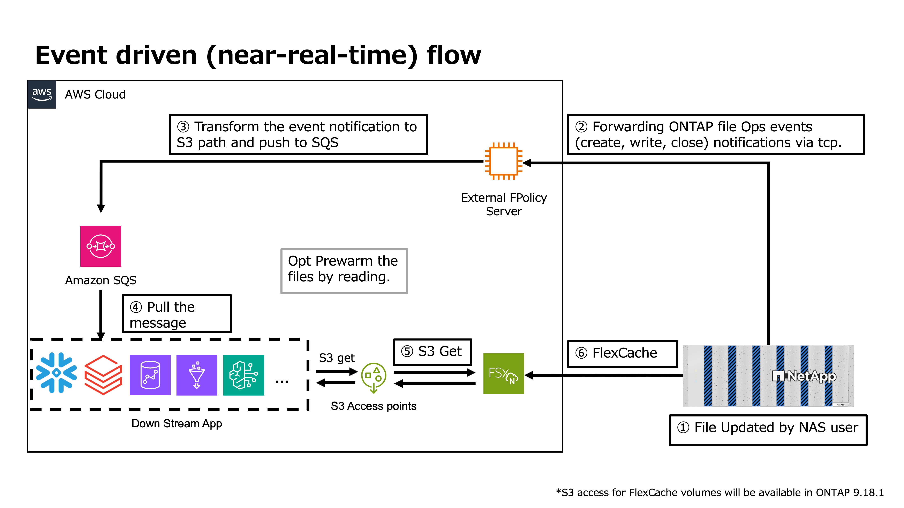
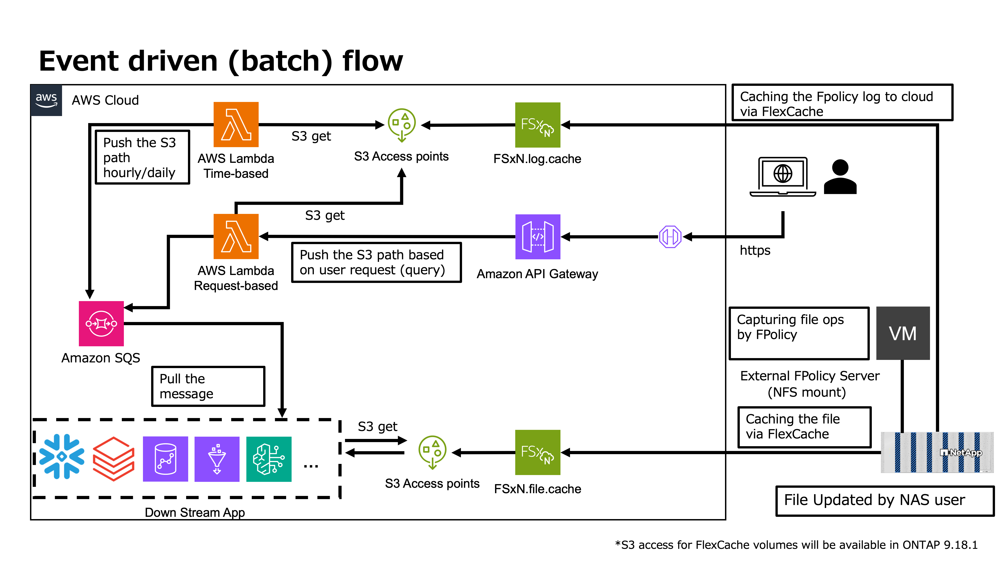

# ontap-fpolicy-aws-integration
A file event monitoring solution for NetApp ONTAP leveraging FPolicy External Server to integrate with AWS services.

This project enables near-real-time or batch monitoring of file operations (create, delete, modify, rename, etc.) on NetApp ONTAP systems. It supports:

	•	Local logging for on-premises event tracking
	•	Integration with AWS services via Amazon SQS & Lambda
	•	Event-driven architecture for cloud-based processing

Important:
Users are responsible for configuring appropriate IAM permissions, Security Groups, firewall rules, routing settings, and any other necessary network or security configurations within their environment.





---

### Use Cases
- **Audit & Compliance**: Track all file operations for compliance requirements
- **Data Pipelines**: Trigger downstream processing when files are created
- **Security Monitoring**: Detect suspicious file access patterns
- **Analytics**: Analyze file usage patterns and access trends
- **Event-Driven Architectures**: Integrate FSxN with Lambda, Step Functions, etc.

---

## Architecture

```
Client → NetApp ONTAP (FPolicy) → External Server → Local Logs / SQS
                                                   ↓
                                            Lambda Processor
                                                   ↓
                                            Downstream Apps
```

---

## Log Format

**Local Logs (JSON Lines):**
```json
{"timestamp": "2026-02-18 12:30:00", "operation": "create", "file_path": "/vol_onpre/file.txt", "source": "FSxN FPolicy"}
```

**SQS Messages (S3 Event Format):**
```json
{
  "Records": [{
    "eventName": "ObjectCreated:Put",
    "s3": {"object": {"key": "file.txt"}}
  }]
}
```

---

## Configuration

# Step 1: Create External Engine
Create FPolicy External Engine
```
vserver fpolicy policy external-engine create \\
  -vserver $VSERVER \\
  -engine-name $ENGINE_NAME \\
  -primary-servers $EC2_IP \\
  -port $FPOLICY_PORT \\
  -extern-engine-type asynchronous
```

# Step 2: Create Event
Create FPolicy Event
```
vserver fpolicy policy event create \\
  -vserver $VSERVER \\
  -event-name $EVENT_NAME \\
  -protocol $PROTOCOL \\
  -file-operations $FILE_OPERATIONS
```

# Step 3: Create Policy
Create FPolicy Policy
```
vserver fpolicy policy create \\
  -vserver $VSERVER \\
  -policy-name $POLICY_NAME \\
  -events $EVENT_NAME \\
  -engine $ENGINE_NAME
```

# Step 4: Create Scope
Create FPolicy Scope
```
vserver fpolicy policy scope create \\
  -vserver $VSERVER \\
  -policy-name $POLICY_NAME \\
  -volumes-to-include $VOLUME
```

# Step 5: Enable Policy
Enable FPolicy
```
vserver fpolicy enable \\
  -vserver $VSERVER \\
  -policy-name $POLICY_NAME
```

# Verification Commands

Check FPolicy status
```
vserver fpolicy show -vserver $VSERVER
```

Check engine connection
```
vserver fpolicy show-engine -vserver $VSERVER
```

View detailed configuration
```
vserver fpolicy policy show -vserver $VSERVER -policy-name $POLICY_NAME -instance
```
```
vserver fpolicy policy event show -vserver $VSERVER -event-name $EVENT_NAME -instance
```
```
vserver fpolicy policy external-engine show -vserver $VSERVER -engine-name $ENGINE_NAME -instance
```

## Important Note on Event Semantics

This repository uses ONTAP FPolicy events as triggers for downstream processing.  
These events should **not** be interpreted as having the same semantics as Amazon S3 `ObjectCreated` events.

In particular, when using NFS workloads, an FPolicy notification may be observed **before the file write has fully completed** from the application perspective.  
Therefore, downstream consumers must **not assume that the target file is already complete and ready for processing** at the moment the event is received.

This is especially important for:
- large files
- long-running writes
- near-real-time pipelines that immediately read the target file after receiving an event

### NFSv3 limitation
For NFSv3, this limitation is more significant because NFSv3 is stateless and does not provide a `CLOSE` operation that can be used for completion-based event handling.  
As a result, this implementation cannot treat NFSv3 events as "write-complete" notifications.

### Recommendation
If strict "write-complete" semantics are required, additional workload-side design considerations are necessary.  
Examples may include:
- application-side rename-on-completion patterns
- protocol/version choices that support stronger completion semantics
- additional downstream readiness checks before processing
